# **데이터베이스 설계 정의서 (Database Design Specification)**

## **1. 개요 (Overview)**

본 문서는 HR 시스템의 데이터 저장소 구조를 정의한다. 모듈형 모놀리스(Modular Monolith) 아키텍처 원칙에 따라, 논리적으로는 관계(Relation)를 맺고 있지만 물리적으로는 강한 제약(Foreign Key Constraint)을 최소화하는 방식을 채택한다.
특히 멀티 테넌트(Multi-Tenant) 환경을 지원하기 위해 `companies` 테이블을 최상위에 두고, 모든 테넌트 종속 데이터 테이블에 `company_id`를 포함하여 **데이터 격리(Data Isolation)**를 수행한다.

### **1.1 설계 원칙**

1. **Logical Relationships over Physical Constraints:** 성능 이슈 및 추후 마이크로서비스 분리를 대비해 물리적 `FOREIGN KEY` 제약조건은 최소화하고, 인덱스(Index)와 애플리케이션 로직으로 관계를 관리한다.
2. **Tenant Isolation (Mandatory):** 모든 테넌트별 데이터 테이블은 `company_id`를 PK 또는 복합 Unique Key의 첫 번째 컬럼으로 포함하여 인덱스 효율성을 높이고 타 테넌트 데이터 접근을 원천 차단한다.
3. **Audit Columns:** 모든 테이블에는 `created_at`, `updated_at`을 기본 포함하며, 비즈니스 중요도가 높은 테이블은 `created_by`, `updated_by`를 포함한다.
4. **Deterministic States:** 상태를 나타내는 컬럼은 단순 문자열이 아닌, 시스템에서 정의한 **ENUM** 값만 허용하여 로직의 모호함을 제거한다.

## **2. 논리적 데이터 모델 (Logical Data Model)**

모듈(Bounded Context) 단위로 그룹화된 엔티티 관계도(ERD)이다. 모든 데이터의 루트는 **COMPANIES**이다.

```mermaid
erDiagram
    %% ==========================================
    %% 0. System & Tenant Module (Root)
    %% ==========================================
    COMPANIES {
        bigint id PK
        string name
        string domain
        enum status "ACTIVE | INACTIVE | SUSPENDED"
    }

    %% ==========================================
    %% 1. User & Organization Module
    %% ==========================================
    USERS {
        bigint id PK
        bigint company_id FK "Tenant Root"
        bigint dept_id FK
        enum role "SUPER_ADMIN | TENANT_ADMIN | USER"
    }
    DEPARTMENTS {
        bigint id PK
        bigint company_id FK
        bigint parent_id FK
        string path_string "Materialized Path"
    }
    
    COMPANIES ||--o{ USERS : "employs"
    COMPANIES ||--o{ DEPARTMENTS : "organizes"
    DEPARTMENTS ||--o{ DEPARTMENTS : "hierarchy"
    DEPARTMENTS |o--o{ USERS : "belongs_to"

    %% ==========================================
    %% 2. Approval Module
    %% ==========================================
    APPROVAL_REQUESTS {
        bigint id PK
        bigint company_id FK
        bigint requester_id FK
        enum status "PENDING | APPROVED | REJECTED | CANCELED"
        string resource_type "VACATION | EXPENSE..."
    }
    APPROVAL_STEPS {
        bigint id PK
        bigint request_id FK
        bigint approver_id FK
        int step_order
        enum status "WAITING | APPROVED | REJECTED"
    }

    APPROVAL_REQUESTS ||--o{ APPROVAL_STEPS : "has_steps"
    USERS ||--o{ APPROVAL_REQUESTS : "requests"
    USERS ||--o{ APPROVAL_STEPS : "approves"

    %% ==========================================
    %% 3. Policy Module
    %% ==========================================
    ACCESS_GRANTS {
        bigint id PK
        bigint grantee_user_id FK
        string resource_type
        bigint resource_id
    }
    USERS ||--o{ ACCESS_GRANTS : "has_permission"

    %% ==========================================
    %% 4. HR Domain - Vacation
    %% ==========================================
    VACATION_BALANCES {
        bigint id PK
        bigint user_id FK
        int year
        float remaining_days
    }
    VACATION_REQUESTS {
        bigint id PK
        bigint user_id FK
        enum type "ANNUAL | HALF_AM | SICK..."
        enum status "PENDING | APPROVED..."
    }
    
    USERS ||--o{ VACATION_BALANCES : "owns"
    USERS ||--o{ VACATION_REQUESTS : "applies"

    %% ==========================================
    %% 5. HR Domain - Payroll
    %% ==========================================
    PAYROLLS {
        bigint id PK
        bigint company_id FK
        string target_month "YYYY-MM"
        enum status "DRAFT | CONFIRMED | PAID"
    }
    PAYSLIPS {
        bigint id PK
        bigint payroll_id FK
        bigint user_id FK
        decimal net_pay
    }
    PAYSLIP_ITEMS {
        bigint id PK
        bigint payslip_id FK
        enum type "ALLOWANCE | DEDUCTION"
        decimal amount
    }

    PAYROLLS ||--o{ PAYSLIPS : "distributes"
    PAYSLIPS ||--o{ PAYSLIP_ITEMS : "details"
    USERS ||--o{ PAYSLIPS : "receives"

    %% ==========================================
    %% 6. HR Domain - Evaluation & Attendance
    %% ==========================================
    EVALUATION_CYCLES {
        bigint id PK
        enum status "DRAFT | OPEN | CLOSED"
    }
    EVALUATIONS {
        bigint id PK
        bigint cycle_id FK
        bigint target_user_id FK
        string final_grade
    }
    EVALUATION_RECORDS {
        bigint id PK
        bigint evaluation_id FK
        bigint rater_user_id FK
        enum rater_type "SELF | PEER | MANAGER"
    }
    ATTENDANCE_LOGS {
        bigint id PK
        bigint user_id FK
        enum work_type "OFFICE | REMOTE"
    }

    EVALUATION_CYCLES ||--o{ EVALUATIONS : "contains"
    EVALUATIONS ||--o{ EVALUATION_RECORDS : "input_from"
    USERS ||--o{ ATTENDANCE_LOGS : "punches"

    %% ==========================================
    %% 7. Assets & Notifications
    %% ==========================================
    ASSETS {
        bigint id PK
        bigint current_user_id FK
        enum status "AVAILABLE | ASSIGNED..."
    }
    NOTIFICATION_LOGS {
        bigint id PK
        bigint company_id FK
        string recipient_email
        enum status "SENT | FAILED"
    }
    ANNOUNCEMENTS {
        bigint id PK
        bigint company_id FK
        string title
        string content
        string author
        string type "NOTICE | URGENT"
    }
    IN_APP_NOTIFICATIONS {
        bigint id PK
        bigint company_id FK
        bigint recipient_id FK
        string message
        boolean is_read
    }
    APPROVAL_RULES {
        bigint id PK
        bigint company_id FK
        string request_type
        string approval_line_key "TEAM_LEADER | DEPT_HEAD | CEO"
    }
    
    USERS |o--o{ ASSETS : "uses"
    COMPANIES ||--o{ ANNOUNCEMENTS : "posts"
    USERS ||--o{ IN_APP_NOTIFICATIONS : "receives"
    COMPANIES ||--o{ APPROVAL_RULES : "defines"

```



## **3. 상태 값 정의 (Enum Definitions)**

데이터의 정합성을 보장하고 비즈니스 로직 분기를 명확히 하기 위해 허용되는 상태 값을 정의한다.

| 모듈 | 컬럼명 | 허용 값 (ENUM) | 설명 |
| --- | --- | --- | --- |
| **Common** | `status` (Company) | `ACTIVE` | 정상 서비스 이용 중 |
|  |  | `INACTIVE` | 서비스 해지 또는 만료 |
|  |  | `SUSPENDED` | 미납 등으로 인한 일시 정지 |
| **User** | `role` | `SUPER_ADMIN` | 전체 시스템 관리자 (개발사) |
|  |  | `TENANT_ADMIN` | 고객사 관리자 (인사팀장 등) |
|  |  | `USER` | 일반 임직원 |
| **Approval** | `status` | `PENDING` | 결재 진행 중 |
|  |  | `APPROVED` | 승인 완료 |
|  |  | `REJECTED` | 반려됨 |
|  |  | `CANCELED` | 기안자 회수/취소 |
| **Vacation** | `vacation_type` | `ANNUAL` | 연차 (1일 차감) |
|  |  | `HALF_AM` / `HALF_PM` | 오전/오후 반차 (0.5일 차감) |
|  |  | `SICK` | 병가 |
|  |  | `UNPAID` | 무급 휴가 |
| **Attendance** | `work_type` | `OFFICE` | 사무실 출근 |
|  |  | `REMOTE` | 재택 근무 |
|  |  | `BUSINESS_TRIP` | 외근/출장 |
| **Asset** | `status` | `AVAILABLE` | 재고 보유 (지급 가능) |
|  |  | `ASSIGNED` | 사용자 지급됨 |
|  |  | `BROKEN` | 파손/수리 중 |
|  |  | `DISCARDED` | 폐기됨 |
| **Notification** | `type` (Announcement) | `NOTICE` | 일반 공지 |
|  |  | `URGENT` | 긴급 공지 |
| **Approval** | `approval_line_key` | `TEAM_LEADER` | 직속 상사(팀장) |
|  |  | `DEPT_HEAD` | 부서장 |
|  |  | `CEO` | 대표이사 |

## **4. 데이터 보존 및 삭제 정책 (Retention Policy)**

법적 요구사항 및 시스템 성능 최적화를 위한 데이터 수명주기 정책이다.

| 데이터 유형 | 보존 기간 | 처리 방식 | 관련 법령/사유 |
| --- | --- | --- | --- |
| **근태 로그** | 3년 | Cold Storage 이관 후 테이블 삭제 | 근로기준법 |
| **급여 대장** | 5년 | 영구 보존 (별도 아카이브 DB 권장) | 소득세법 |
| **알림 로그** | 6개월 | Hard Delete (일일 배치) | 스토리지 절약 |
| **퇴사자 정보** | 3년 | 개인정보 컬럼 마스킹 처리 | 개인정보보호법 |

## **5. 물리적 데이터 모델 (Physical DDL)**

DBMS: **MySQL 8.0+** / MariaDB 10.5+
Charset: `utf8mb4`, Collation: `utf8mb4_unicode_ci`

### **5.1 시스템 및 테넌트 (System Core)**

```sql
-- 1. Companies (테넌트 마스터)
CREATE TABLE companies (
    id BIGINT AUTO_INCREMENT PRIMARY KEY,
    name VARCHAR(100) NOT NULL COMMENT '회사명',
    domain VARCHAR(100) NOT NULL COMMENT '전용 도메인 (hr.samsung.com)',
    business_number VARCHAR(20) DEFAULT NULL COMMENT '사업자등록번호',
    
    status ENUM('ACTIVE','INACTIVE','SUSPENDED') NOT NULL DEFAULT 'ACTIVE',
    plan_type VARCHAR(20) DEFAULT 'BASIC' COMMENT 'BASIC, PRO, ENTERPRISE',
    expired_at DATE NULL COMMENT '서비스 만료일',
    
    created_at TIMESTAMP DEFAULT CURRENT_TIMESTAMP,
    updated_at TIMESTAMP DEFAULT CURRENT_TIMESTAMP ON UPDATE CURRENT_TIMESTAMP,
    
    UNIQUE KEY uk_company_domain (domain)
) ENGINE=InnoDB COMMENT='고객사(테넌트) 정보';

```

### **5.2 공통 모듈 (User & Organization)**

```sql
-- 2. Users (사용자)
CREATE TABLE users (
    id BIGINT AUTO_INCREMENT PRIMARY KEY,
    company_id BIGINT NOT NULL COMMENT 'Tenant ID',
    dept_id BIGINT NULL COMMENT '소속 부서 ID',
    
    email VARCHAR(100) NOT NULL,
    password_hash VARCHAR(255) NOT NULL,
    name VARCHAR(50) NOT NULL,
    
    role ENUM('SUPER_ADMIN', 'TENANT_ADMIN', 'USER') NOT NULL DEFAULT 'USER',
    
    created_at TIMESTAMP DEFAULT CURRENT_TIMESTAMP,
    updated_at TIMESTAMP DEFAULT CURRENT_TIMESTAMP ON UPDATE CURRENT_TIMESTAMP,
    
    UNIQUE KEY uk_user_email (email),
    INDEX idx_user_company (company_id),
    FOREIGN KEY (company_id) REFERENCES companies(id)
) ENGINE=InnoDB COMMENT='사용자 계정 정보';

-- 3. Departments (조직)
CREATE TABLE departments (
    id BIGINT AUTO_INCREMENT PRIMARY KEY,
    company_id BIGINT NOT NULL,
    parent_id BIGINT NULL,
    
    name VARCHAR(100) NOT NULL,
    path_string VARCHAR(1000) NULL COMMENT '계층 구조 검색용 경로 (ex: /1/5/10)',
    depth INT DEFAULT 0,
    
    created_at TIMESTAMP DEFAULT CURRENT_TIMESTAMP,
    
    FOREIGN KEY (company_id) REFERENCES companies(id),
    INDEX idx_dept_company (company_id)
) ENGINE=InnoDB COMMENT='부서 정보';

```

### **5.3 결재 모듈 (Approval Engine)**

```sql
-- 4. Approval Requests
CREATE TABLE approval_requests (
    id BIGINT AUTO_INCREMENT PRIMARY KEY,
    company_id BIGINT NOT NULL,
    requester_user_id BIGINT NOT NULL COMMENT '기안자',
    
    title VARCHAR(200) NOT NULL,
    resource_type VARCHAR(50) NOT NULL COMMENT '연동 모듈 (VACATION, PAYROLL 등)',
    resource_id BIGINT NOT NULL COMMENT '연동 모듈의 PK',
    
    status ENUM('PENDING', 'APPROVED', 'REJECTED', 'CANCELED') NOT NULL DEFAULT 'PENDING',
    current_step_order INT DEFAULT 1,
    
    created_at TIMESTAMP DEFAULT CURRENT_TIMESTAMP,
    updated_at TIMESTAMP DEFAULT CURRENT_TIMESTAMP ON UPDATE CURRENT_TIMESTAMP,
    
    INDEX idx_approval_req_user (requester_user_id),
    FOREIGN KEY (company_id) REFERENCES companies(id)
) ENGINE=InnoDB;

-- 5. Approval Steps
CREATE TABLE approval_steps (
    id BIGINT AUTO_INCREMENT PRIMARY KEY,
    request_id BIGINT NOT NULL,
    approver_id BIGINT NOT NULL,
    
    step_order INT NOT NULL COMMENT '결재 순서 (1, 2, 3...)',
    status ENUM('WAITING', 'APPROVED', 'REJECTED') NOT NULL DEFAULT 'WAITING',
    comment TEXT NULL COMMENT '승인/반려 코멘트',
    
    processed_at DATETIME NULL,
    
    FOREIGN KEY (request_id) REFERENCES approval_requests(id)
) ENGINE=InnoDB;

```

### **5.4 권한 및 정책 (Policy)**

```sql
-- 6. Access Grants (동적 권한 매핑)
CREATE TABLE access_grants (
    id BIGINT AUTO_INCREMENT PRIMARY KEY,
    grantee_user_id BIGINT NOT NULL,
    
    resource_type VARCHAR(50) NOT NULL COMMENT '대상 리소스 (DEPT, DOC 등)',
    resource_id BIGINT NOT NULL COMMENT '대상 리소스 ID',
    permission VARCHAR(50) NOT NULL COMMENT '권한 내용 (READ, WRITE)',
    
    created_at TIMESTAMP DEFAULT CURRENT_TIMESTAMP,
    expires_at DATETIME NULL COMMENT '권한 만료일 (옵션)',
    
    INDEX idx_access_grantee (grantee_user_id)
) ENGINE=InnoDB;

```

### **5.5 HR 도메인 (Vacation, Payroll, Attendance)**

```sql
-- 7. Vacation Balances (연차 잔여량)
CREATE TABLE vacation_balances (
    id BIGINT AUTO_INCREMENT PRIMARY KEY,
    company_id BIGINT NOT NULL,
    user_id BIGINT NOT NULL,
    year INT NOT NULL COMMENT '회계 연도',
    
    total_days FLOAT DEFAULT 0 COMMENT '발생 연차',
    used_days FLOAT DEFAULT 0 COMMENT '사용 연차',
    remaining_days FLOAT DEFAULT 0 COMMENT '잔여 연차',
    
    updated_at TIMESTAMP DEFAULT CURRENT_TIMESTAMP ON UPDATE CURRENT_TIMESTAMP,
    
    UNIQUE KEY uk_vac_balance (user_id, year),
    FOREIGN KEY (user_id) REFERENCES users(id)
) ENGINE=InnoDB;

-- 8. Vacation Requests (연차 신청)
CREATE TABLE vacation_requests (
    id BIGINT AUTO_INCREMENT PRIMARY KEY,
    company_id BIGINT NOT NULL,
    user_id BIGINT NOT NULL,
    
    vacation_type ENUM('ANNUAL','HALF_AM','HALF_PM','SICK','UNPAID') NOT NULL,
    start_date DATE NOT NULL,
    end_date DATE NOT NULL,
    request_days FLOAT NOT NULL COMMENT '0.5 단위 가능',
    reason VARCHAR(255) NULL,
    
    status ENUM('PENDING', 'APPROVED', 'REJECTED', 'CANCELED') NOT NULL DEFAULT 'PENDING',
    approval_request_id BIGINT NULL COMMENT '결재 모듈 연동 ID',
    
    created_at TIMESTAMP DEFAULT CURRENT_TIMESTAMP,
    
    FOREIGN KEY (user_id) REFERENCES users(id)
) ENGINE=InnoDB;

-- 9. Payrolls (급여 대장 마스터)
CREATE TABLE payrolls (
    id BIGINT AUTO_INCREMENT PRIMARY KEY,
    company_id BIGINT NOT NULL,
    
    title VARCHAR(100) NOT NULL,
    target_year INT NOT NULL,
    target_month INT NOT NULL,
    payment_date DATE NOT NULL,
    
    total_amount DECIMAL(19, 2) NOT NULL DEFAULT 0,
    status ENUM('DRAFT', 'CONFIRMED', 'PAID') NOT NULL DEFAULT 'DRAFT',
    
    created_at TIMESTAMP DEFAULT CURRENT_TIMESTAMP,
    updated_at TIMESTAMP DEFAULT CURRENT_TIMESTAMP ON UPDATE CURRENT_TIMESTAMP,
    
    INDEX idx_payroll_target (company_id, target_year, target_month),
    FOREIGN KEY (company_id) REFERENCES companies(id)
) ENGINE=InnoDB;

-- 10. Payslips (개인별 급여 명세서)
CREATE TABLE payslips (
    id BIGINT AUTO_INCREMENT PRIMARY KEY,
    payroll_id BIGINT NOT NULL,
    user_id BIGINT NOT NULL,
    
    total_allowance DECIMAL(19, 2) NOT NULL DEFAULT 0 COMMENT '지급 총액',
    total_deduction DECIMAL(19, 2) NOT NULL DEFAULT 0 COMMENT '공제 총액',
    net_pay DECIMAL(19, 2) NOT NULL DEFAULT 0 COMMENT '실수령액',
    
    FOREIGN KEY (payroll_id) REFERENCES payrolls(id),
    FOREIGN KEY (user_id) REFERENCES users(id)
) ENGINE=InnoDB;

-- 11. Payslip Items (급여 상세 항목)
CREATE TABLE payslip_items (
    id BIGINT AUTO_INCREMENT PRIMARY KEY,
    payslip_id BIGINT NOT NULL,
    
    type ENUM('ALLOWANCE', 'DEDUCTION') NOT NULL,
    name VARCHAR(50) NOT NULL COMMENT '기본급, 식대, 소득세 등',
    amount DECIMAL(19, 2) NOT NULL,
    
    FOREIGN KEY (payslip_id) REFERENCES payslips(id)
) ENGINE=InnoDB;

-- 12. Attendance Logs (근태 기록)
CREATE TABLE attendance_logs (
    id BIGINT AUTO_INCREMENT PRIMARY KEY,
    company_id BIGINT NOT NULL,
    user_id BIGINT NOT NULL,
    date DATE NOT NULL,
    
    work_type ENUM('OFFICE', 'REMOTE', 'BUSINESS_TRIP') DEFAULT 'OFFICE',
    check_in_time DATETIME NULL,
    check_out_time DATETIME NULL,
    ip_address VARCHAR(50) NULL,
    
    UNIQUE KEY uk_attendance_daily (user_id, date),
    FOREIGN KEY (user_id) REFERENCES users(id)
) ENGINE=InnoDB;

```

### **5.6 인사평가 (Evaluations)**

```sql
-- 13. Evaluation Cycles (평가 회차)
CREATE TABLE evaluation_cycles (
    id BIGINT AUTO_INCREMENT PRIMARY KEY,
    company_id BIGINT NOT NULL,
    
    title VARCHAR(100) NOT NULL,
    year INT NOT NULL,
    start_date DATE NOT NULL,
    end_date DATE NOT NULL,
    
    status ENUM('DRAFT', 'OPEN', 'CLOSED', 'ARCHIVED') NOT NULL DEFAULT 'DRAFT',
    
    created_at TIMESTAMP DEFAULT CURRENT_TIMESTAMP,
    FOREIGN KEY (company_id) REFERENCES companies(id)
) ENGINE=InnoDB;

-- 14. Evaluations (피평가자 대상)
CREATE TABLE evaluations (
    id BIGINT AUTO_INCREMENT PRIMARY KEY,
    cycle_id BIGINT NOT NULL,
    target_user_id BIGINT NOT NULL,
    
    final_grade CHAR(1) NULL COMMENT 'S, A, B, C, D',
    total_score DECIMAL(5,2) DEFAULT 0,
    status ENUM('READY', 'IN_PROGRESS', 'COMPLETED') DEFAULT 'READY',
    
    UNIQUE KEY uk_eval_target (cycle_id, target_user_id),
    FOREIGN KEY (cycle_id) REFERENCES evaluation_cycles(id)
) ENGINE=InnoDB;

-- 15. Evaluation Records (개별 평가 기록)
CREATE TABLE evaluation_records (
    id BIGINT AUTO_INCREMENT PRIMARY KEY,
    evaluation_id BIGINT NOT NULL,
    rater_user_id BIGINT NOT NULL COMMENT '평가자',
    
    rater_type ENUM('SELF', 'PEER', 'MANAGER') NOT NULL,
    score DECIMAL(5,2) DEFAULT 0,
    comment TEXT NULL,
    
    submitted_at DATETIME NULL,
    FOREIGN KEY (evaluation_id) REFERENCES evaluations(id)
) ENGINE=InnoDB;

```

### **5.7 자산 및 알림 (Assets & Noti)**

```sql
-- 16. Assets
CREATE TABLE assets (
    id BIGINT AUTO_INCREMENT PRIMARY KEY,
    company_id BIGINT NOT NULL,
    current_user_id BIGINT NULL COMMENT '사용자 할당 시 NOT NULL',
    
    category ENUM('LAPTOP', 'DESKTOP', 'MONITOR', 'ACCESSORY', 'SOFTWARE') NOT NULL,
    model_name VARCHAR(100) NOT NULL,
    serial_number VARCHAR(100) NULL,
    
    purchase_date DATE NULL,
    status ENUM('AVAILABLE', 'ASSIGNED', 'BROKEN', 'DISCARDED') NOT NULL DEFAULT 'AVAILABLE',
    
    created_at TIMESTAMP DEFAULT CURRENT_TIMESTAMP,
    updated_at TIMESTAMP DEFAULT CURRENT_TIMESTAMP ON UPDATE CURRENT_TIMESTAMP,
    
    UNIQUE KEY uk_asset_serial (company_id, serial_number),
    FOREIGN KEY (company_id) REFERENCES companies(id)
) ENGINE=InnoDB;

-- 17. Notification Logs
CREATE TABLE notification_logs (
    id BIGINT AUTO_INCREMENT PRIMARY KEY,
    company_id BIGINT NOT NULL,
    recipient_email VARCHAR(100) NOT NULL,
    
    subject VARCHAR(255) NOT NULL,
    message TEXT NOT NULL,
    status ENUM('SENT', 'FAILED') NOT NULL,
    error_message TEXT NULL,
    
    event_type VARCHAR(50) NOT NULL COMMENT 'APPROVAL_REQ, EVAL_OPEN 등',
    sent_at TIMESTAMP DEFAULT CURRENT_TIMESTAMP,
    
    INDEX idx_noti_company (company_id),
    INDEX idx_noti_date (sent_at)
) ENGINE=InnoDB;

-- 18. Announcements (공지사항)
CREATE TABLE announcements (
    id BIGINT AUTO_INCREMENT PRIMARY KEY,
    company_id BIGINT NOT NULL,
    title VARCHAR(255) NOT NULL,
    content TEXT NOT NULL,
    author VARCHAR(100) NOT NULL,
    type VARCHAR(20) NOT NULL DEFAULT 'NOTICE' COMMENT 'NOTICE, URGENT',
    
    created_at TIMESTAMP DEFAULT CURRENT_TIMESTAMP,
    modified_at TIMESTAMP DEFAULT CURRENT_TIMESTAMP ON UPDATE CURRENT_TIMESTAMP,
    
    INDEX idx_announcement_company (company_id)
) ENGINE=InnoDB;

-- 19. In-App Notifications (사내 알림)
CREATE TABLE in_app_notifications (
    id BIGINT AUTO_INCREMENT PRIMARY KEY,
    company_id BIGINT NOT NULL,
    recipient_id BIGINT NOT NULL,
    message VARCHAR(500) NOT NULL,
    link VARCHAR(255) NULL,
    is_read BOOLEAN NOT NULL DEFAULT FALSE,
    
    created_at TIMESTAMP DEFAULT CURRENT_TIMESTAMP,
    
    INDEX idx_in_app_noti_recipient (recipient_id),
    INDEX idx_in_app_noti_company (company_id)
) ENGINE=InnoDB;

-- 20. Approval Rules (결재 전결 규정)
CREATE TABLE approval_rules (
    id BIGINT AUTO_INCREMENT PRIMARY KEY,
    company_id BIGINT NOT NULL,
    request_type VARCHAR(50) NOT NULL COMMENT 'VACATION, PAYROLL 등',
    min_amount BIGINT DEFAULT 0,
    max_amount BIGINT DEFAULT 0,
    approval_line_key VARCHAR(50) NOT NULL COMMENT 'TEAM_LEADER, DEPT_HEAD, CEO 등',
    priority INT NOT NULL DEFAULT 0,
    
    INDEX idx_approval_rule_type (company_id, request_type)
) ENGINE=InnoDB;

```