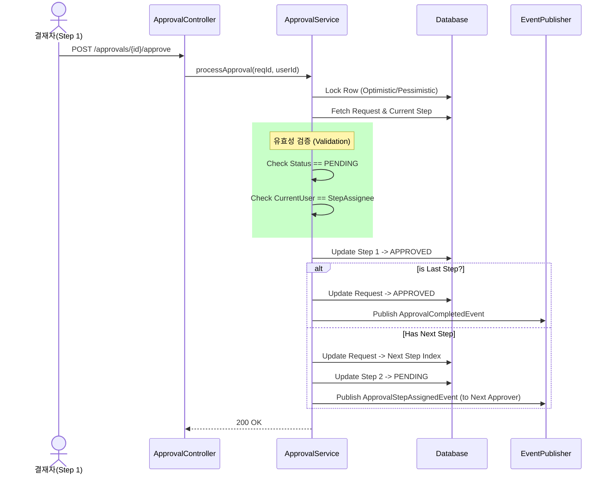

# **심층 요구사항 명세서: 결재 워크플로우 시스템 (SPEC-01)**

## **0. 문서 이력 (Version History)**

| 버전 | 일자 | 작성자 | 내용 | 비고 |
| :--- | :--- | :--- | :--- | :--- |
| v1.0 | 2024-12-18 | System | 최초 작성 | 결재 상태 모델링 및 상태 전이 정의 |


## **1. 개요 (Overview)**

### **1.1 목적**
본 문서는 HR 시스템의 핵심 엔진인 **결재 모듈(Approval Module)**의 동작 원리, 상태 전이 규칙, 데이터 흐름 및 예외 처리를 정의한다.
결재 시스템은 휴가, 급여 정산, 자산 신청 등 다양한 도메인의 리소스(Resource)에 대해 승인 프로세스를 처리하는 **공통 엔진**으로 동작한다.

### **1.2 범위**
* **Sequential Workflow:** 결재선은 순차적으로 처리된다 (Step 1 승인 -> Step 2 진행).
* **Atomic Decision:** 하나의 단계라도 반려되면 전체 요청은 즉시 반려된다.
* **Immutability:** 결재가 완료된(승인/반려) 문서는 수정할 수 없다.

---

## **2. 상태 모델링 (State Modeling)**

결재 시스템의 무결성은 **요청(Request)**과 **단계(Step)** 두 가지 레벨의 상태 관리에 달려 있다.

### **2.1 상태 정의 (State Definitions)**

| 상태 (Status) | 대상 | 설명 |
| :--- | :--- | :--- |
| **PENDING** | Request, Step | 현재 처리가 진행 중인 상태. (Request는 전체 진행 중, Step은 본인 차례 도래) |
| **WAITING** | Step | 아직 내 차례가 오지 않음 (이전 단계 승인 대기). |
| **APPROVED** | Request, Step | 승인됨. (Request는 모든 단계 승인 시, Step은 해당 단계 승인 시) |
| **REJECTED** | Request, Step | 반려됨. (더 이상 진행 불가) |
| **CANCELED** | Request | 기안자가 요청을 회수함. |

### **2.2 상태 전이 매트릭스 (State Transition Matrix)**

시스템은 아래 진리표에 정의되지 않은 상태 전이를 허용하지 않는다.

#### **(A) 결재 요청 (Approval Request) 레벨**

| 현재 상태 | 이벤트 (Trigger) | 조건 (Guard) | 다음 상태 | 액션 (Action) |
| :--- | :--- | :--- | :--- | :--- |
| **NULL** | `request()` | 유효성 검증 통과 | **PENDING** | 1번 Step 상태를 PENDING으로 변경 |
| **PENDING** | `approve(step N)` | N < Last Step | **PENDING** | (N+1)번 Step 상태를 PENDING으로 변경 |
| **PENDING** | `approve(step N)` | N == Last Step | **APPROVED** | `ApprovalCompletedEvent(APPROVED)` 발행 |
| **PENDING** | `reject(step N)` | - | **REJECTED** | 남은 Step들을 SKIPPED 처리, `ApprovalCompletedEvent(REJECTED)` 발행 |
| **PENDING** | `cancel()` | 요청자 == 기안자 | **CANCELED** | 모든 Step 처리 중단 |
| **APPROVED** | `cancel()` | - | **ERROR** | 이미 승인된 건은 취소 불가 (별도 반환 프로세스 필요) |
| **REJECTED** | `approve()` | - | **ERROR** | 반려된 건은 승인 불가 (재기안 필요) |

#### **(B) 결재 단계 (Approval Step) 레벨**

| 현재 상태 | 이벤트 | 다음 상태 | 비고 |
| :--- | :--- | :--- | :--- |
| **WAITING** | 이전 단계 승인 | **PENDING** | 알림 발송 |
| **PENDING** | 승인 버튼 클릭 | **APPROVED** | - |
| **PENDING** | 반려 버튼 클릭 | **REJECTED** | - |
| **WAITING** | Request 취소/반려 | **CANCELED** | 도달하지 못한 단계 처리 |

---

## **3. 데이터 흐름 및 프로세스 (Data Flow & Process)**

### **3.1 결재 승인 프로세스 (Happy Path)**



### **3.2 모듈 간 이벤트 데이터 흐름**

결재 모듈은 도메인 로직(휴가 차감 등)을 직접 수행하지 않고, **이벤트**를 통해 결과를 전파한다.

1. **Approval Module:** `ApprovalCompletedEvent` 발행 (Payload: `resourceType`, `resourceId`, `finalStatus`)
2. **Vacation Module:** 이벤트 리스너가 `resourceType='VACATION'` 확인 → 해당 휴가 요청 상태를 `APPROVED`로 변경 및 연차 차감 확정.
3. **Notification Module:** 기안자에게 "결재가 완료되었습니다" 알림 발송.

## **4. 동시성 제어 및 엣지 케이스 (Concurrency & Edge Cases)**

### **4.1 동시성 제어 정책 (Concurrency Control)**

**시나리오:** 부서장 A와 부서장 B가 공유 승인 단계(Shared Step)에 있거나, 혹은 사용자가 승인 버튼을 더블 클릭하여 요청이 두 번 전송된 경우.

* **전략:** **낙관적 락 (Optimistic Locking)** 적용
* **구현 명세:**
1. `approval_requests` 및 `approval_steps` 테이블에 `@Version version` 컬럼 추가.
2. 업데이트 시 `UPDATE ... SET ... version = version + 1 WHERE id = ? AND version = current_version` 쿼리 실행.
3. `ObjectOptimisticLockingFailureException` 발생 시:
* 사용자에게 "이미 다른 관리자에 의해 처리되었습니다." 메시지 반환 (409 Conflict).


### **4.2 엣지 케이스 처리 (Exception Handling)**

| 케이스 ID | 상황 설명 | 시스템 동작 및 반환 코드 |
| --- | --- | --- |
| **EC-01** | **승인자 불일치** (본인 차례가 아닌데 승인 시도) | **403 Forbidden** <br>

<br> 메시지: "현재 귀하의 결재 순서가 아닙니다." |
| **EC-02** | **이미 처리된 건** (승인 후 다시 승인 시도) | **400 Bad Request** <br>

<br> 메시지: "이미 처리 완료된 결재 건입니다." |
| **EC-03** | **결재선 공백** (다음 결재자가 퇴사하여 User 정보 없음) | **500 Internal Server Error** <br>

<br> 관리자 알림 발송. "결재선 데이터 무결성 오류." |
| **EC-04** | **연동 모듈 에러** (결재 완료 후 휴가 모듈 업데이트 실패) | **트랜잭션 롤백 아님** (Eventual Consistency). <br>

<br> `Retry` 큐에 이벤트 저장 및 재시도 수행. 실패 시 Admin 개입. |

---

## **5. API 및 데이터 규격 (Technical Spec)**

### **5.1 결재 요청 생성 (Command)**

```json
// POST /api/approvals
{
  "resourceType": "VACATION",
  "resourceId": 1050,
  "requesterId": 501,
  "title": "여름 정기 휴가 신청",
  "approverIds": [ 502, 600 ] // 명시적 결재선 지정 (순서대로 1, 2)
}

```

### **5.2 도메인 이벤트 페이로드 (Event Payload)**

```json
// Event: ApprovalCompletedEvent
{
  "requestId": 9999,
  "resourceType": "VACATION",
  "resourceId": 1050,
  "finalStatus": "APPROVED", // or REJECTED
  "processedAt": "2024-12-20T10:00:00Z"
}

```

## **6. 개발 체크리스트 (Implementation Checklist)**

* [ ] `ApprovalRequest` 엔티티에 `@Version` 컬럼이 존재하는가?
* [ ] `ApprovalService`의 `approve` 메서드는 `@Transactional`로 묶여 있는가?
* [ ] 자신의 차례(Current Step Index)가 아닌 사용자의 요청을 막는 `validate` 로직이 존재하는가?
* [ ] 반려 시 이후 단계의 상태를 `CANCELED` 또는 `SKIPPED`로 처리하는 로직이 있는가?
